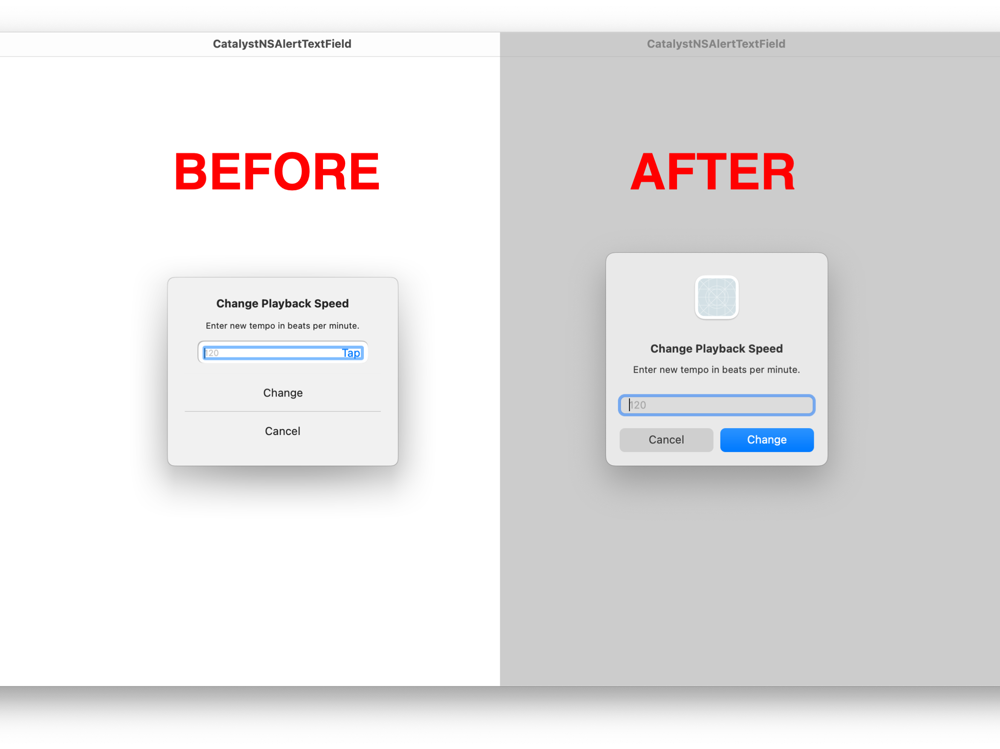

# CatalystNSAlertTextField

Alerts with text fields in Mac Catalyst got you down? Wondering how to bridge them to native `NSAlert`s? This code shows you how.

## Screenshot

## License

This code is licensed under the MIT License. Please respect the terms of the license. Thank you.
